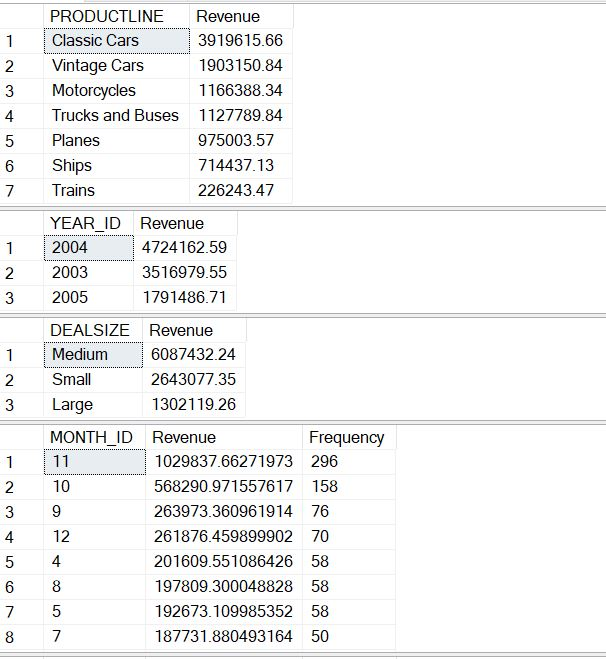
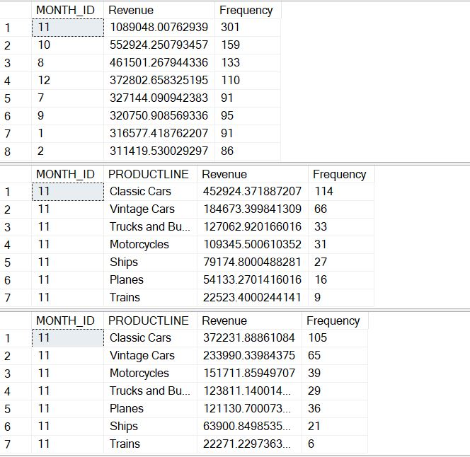
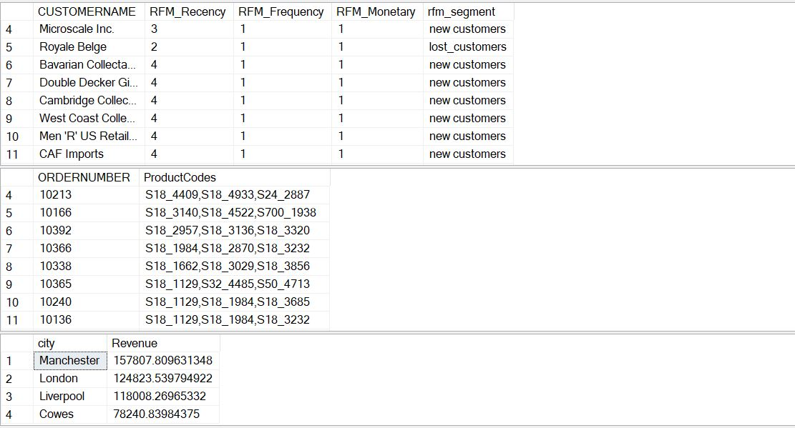
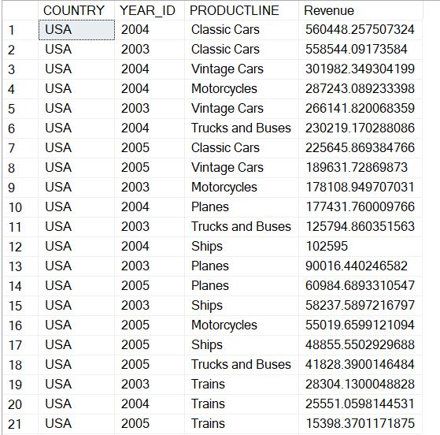

# 📦 Sales Performance & RFM Segmentation Dashboard – Tableau + SQL Project

## 📊 Overview  
This project combines **SQL-driven analytics** with **interactive Tableau dashboards** to analyze revenue trends, product performance, deal sizes, and customer segmentation using RFM logic. The goal is to generate data-driven insights for better sales and marketing decisions.

---

## 🎯 Project Objective  
To develop a comprehensive business intelligence solution that:

- Aggregates sales metrics by key dimensions (product, region, time)  
- Identifies high-performing products and customers  
- Uses **RFM segmentation** to profile customer behavior  
- Visualizes data via interactive dashboards in Tableau

---

## 🧠 SQL Analysis Summary (`RFM_Segmentation_Sales.sql`)

This SQL script includes:

### 1. 📌 Revenue by Product, Year, Deal Size  
- Aggregated metrics using `GROUP BY` across `PRODUCTLINE`, `YEAR_ID`, and `DEALSIZE`.

---

### 2. 🧠 RFM Segmentation Logic  
- Assigns customers a **Recency, Frequency, and Monetary** score from 1 (low) to 4 (high).
- Labels each customer using predefined logic (`new`, `loyal`, `lost_customers`, etc.)

---

### 3. 🛒 Product Order Details + City Revenue  
- Extracts unique product codes per order  
- Summarizes sales by city

---

### 4. 📆 Monthly Revenue & Product Trends  
- Revenue and frequency grouped by `MONTH_ID`  
- Sales breakdown by `PRODUCTLINE` and time

---

### 5. 📉 Overall Revenue Breakdown  
- Full summaries by `PRODUCTLINE`, `YEAR_ID`, and `DEALSIZE`
- Peak performance identified in **November**, **2004**, and **Classic Cars**

---

## 📊 Tableau Dashboard Features

- Revenue by Product Line, Status, Deal Size  
- Monthly Sales by Country and Product  
- Quantity & Sales Distribution  
- RFM Segmentation Visualized

---

## 📈 Key Insights

- 🥇 **Classic Cars** top revenue category  
- 🗓️ **November** (Month 11) leads monthly performance  
- 🌍 Cities like **Manchester**, **London**, and **Liverpool** drive most revenue  
- 🧠 Majority of customers are labeled as `new customers` or `lost customers`, indicating churn risks

---

## 📌 Recommendations

1. **Boost promotions for best-selling product lines**  
2. **Launch retention campaigns for high-risk RFM segments**  
3. **Stock and prepare for Q4 surges (especially November)**  
4. **Target marketing efforts in top-revenue cities**  
5. **Analyze low-frequency segments to increase repeat business**

---

## 🛠️ Tools Used

- **SQL Server / MySQL** – Querying and RFM scoring  
- **Tableau Desktop** – Data visualization  
- **Excel / CSVs** – Raw data preparation

---

## 📎 Files Included

- `Sales Dashboard.twbx` – Tableau workbook with interactive visualizations  
- `RFM_Segmentation_Sales.sql` – SQL file with all revenue queries and RFM logic  
- `sc1.JPG` – Product, deal size, and sales trends  
- `sc2.JPG` – Customer segmentation and distribution  
- `sql1.JPG` to `sql4.JPG` – Preview screenshots of SQL outputs  
