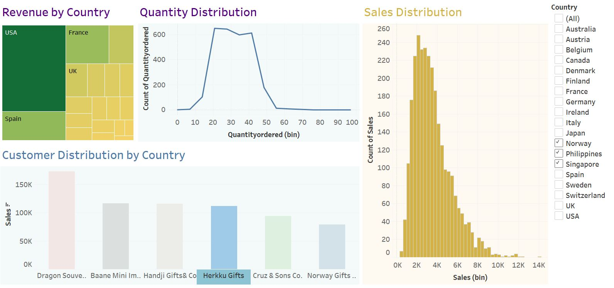
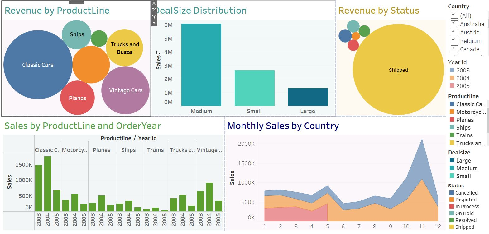

# 📦 Sales Performance & Segmentation Dashboard – Tableau + SQL Project

## 📊 Overview  
This project combines Tableau dashboards with SQL analysis to explore sales performance across products, customers, and geographies. The dashboards provide insight into **product-level revenue**, **deal sizes**, **monthly performance**, and **RFM customer segmentation** using real transactional data.

---

## 🎯 Project Objective  
To build a multi-layered sales analysis dashboard that helps stakeholders:

- Monitor sales by product line, region, and customer  
- Identify high-performing categories and deal sizes  
- Understand customer behavior via RFM segmentation  
- Discover sales opportunities and churn risks

---

## 📊 Dashboard Features

  




### 1. Revenue Breakdown  
- **Revenue by Product Line**: Bubble chart showing top-selling categories (e.g., Classic Cars, Vintage Cars)  
- **Revenue by Status**: Identifies that most revenue comes from shipped orders  
- **Revenue by Country**: Highlights top markets like USA, France, and UK

### 2. Sales Distribution  
- **Sales by Deal Size**: Compares performance of Medium, Small, and Large deals  
- **Sales by Product Line and Year**: Trends across multiple years (2003–2005)  
- **Monthly Sales by Country**: Seasonal breakdown of revenue contribution

### 3. Customer Insights  
- **Quantity Distribution**: Frequency of items ordered by bin  
- **Customer Distribution by Country**: Identifies best buyers by region  
- **Sales Distribution**: Histogram of sales volume per transaction

---

## 📌 RFM Segmentation Logic (SQL)

This project also includes a comprehensive **RFM analysis** done in SQL using the `sales_data_sample` dataset. The segments include:

- `loyal`: Repeat buyers with high value  
- `active`: Recently active with frequent purchases  
- `new customers`: New entrants with strong initial orders  
- `slipping away`: Big spenders at risk of churn  
- `lost_customers`: Long inactive with past purchase history  
- `potential churners`: Mid-range value, declining activity

SQL queries cover grouping by product, year, country, deal size, customer frequency, and sales combinations.

---

## 🧠 Key Insights

- 📌 **Classic Cars** are the most profitable product line  
- 📊 **Medium-size deals** dominate overall sales volume  
- 🌍 **USA** leads in revenue, followed by France and UK  
- 🧮 **RFM Segmentation** helps prioritize loyalty programs and recovery campaigns  
- 📈 **November** is consistently the best-performing month across years

---

## 📌 Recommendations

1. **Promote Best-Selling Product Lines**  
   Focus marketing on Classic & Vintage Cars.

2. **Target Medium-Sized Deal Segments**  
   Maintain inventory and sales focus here for volume and margin.

3. **Use RFM to Drive CRM**  
   Customize email/discount campaigns for loyal and at-risk segments.

4. **Seasonal Preparation**  
   November is a high-revenue month — prep stock and marketing accordingly.

5. **Optimize for Top Countries**  
   Localize campaigns in the US, France, and the UK.

---

## 🛠️ Tools Used  
- Tableau Desktop (`.twbx`)  
- SQL Server / SSMS for querying  
- Dataset: `sales_data_sample` (structured e-commerce transaction data)

---

## 📎 Files Included

```markdown
- `Sales Dashboard.twbx` – Tableau workbook with all dashboard pages  
- `RFM_Segmentation_Sales.sql` – SQL file containing customer segmentation and sales queries  
- `sc1.JPG` – Dashboard screenshot: product, deal size, and country revenue  
- `sc2.JPG` – Dashboard screenshot: customer-level distribution and segmentation  
